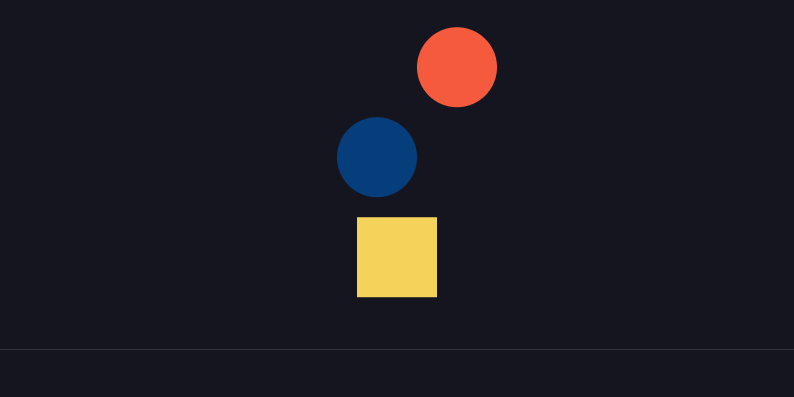

# Angular | Getting Started with matter.js

[Matter.js](https://github.com/liabru/matter-js) is a 2D physics engine for the web.

Creating an angular app with pages using matter.js is easy.

The final result will look like this

